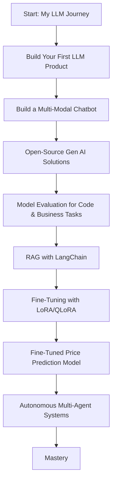

# Jumping Right into LLM Engineering

This documents the launch of an eight-week LLM engineering program, beginning with an immediate, hands-on environment setup and progressing through model selection, fine-tuning, and deployment best practices. Key outcomes include accelerated learner engagement, streamlined technical workflows, and a foundation for scalable LLM applications.

## Context and Objectives

### Project Goals

* Equip participants to install, configure, and run an LLM locally.
* Develop practical skills in prompt design, model adaptation, and deployment.

### Scope

* Covering environment setup, core architecture, fine-tuning, evaluation, and deployment.
* Emphasis on open-source tools and reproducible pipelines.

## Appendices

### Glossary of Terms

* **LLM**: Large Language Model
* **Tokenization**: Converting raw text into discrete model input units
