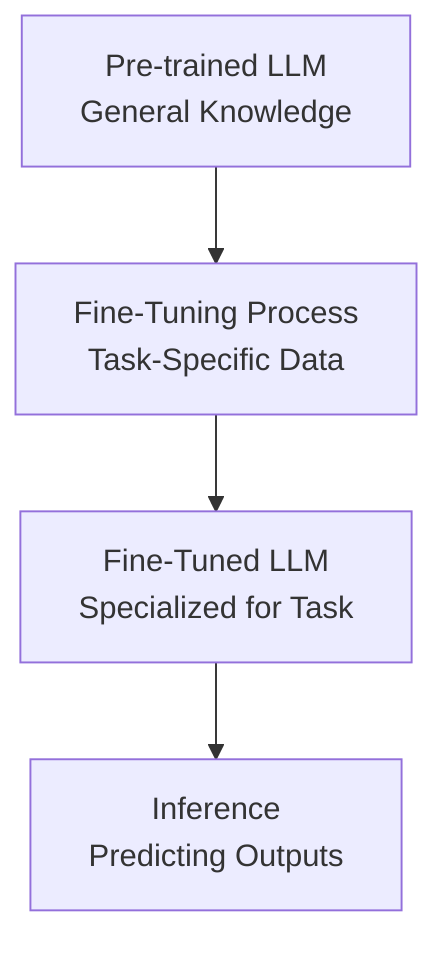
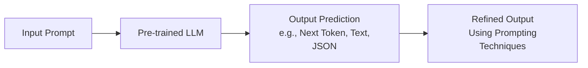
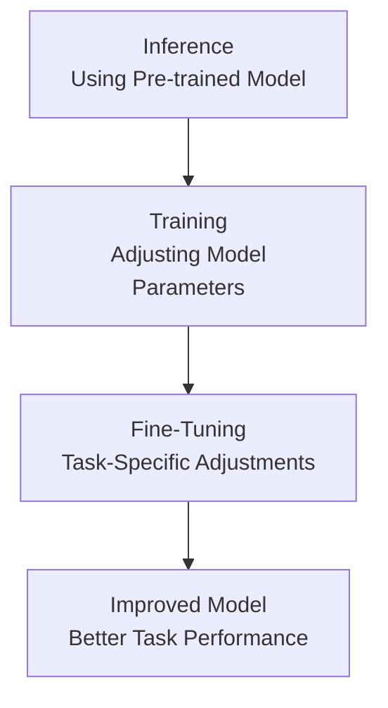
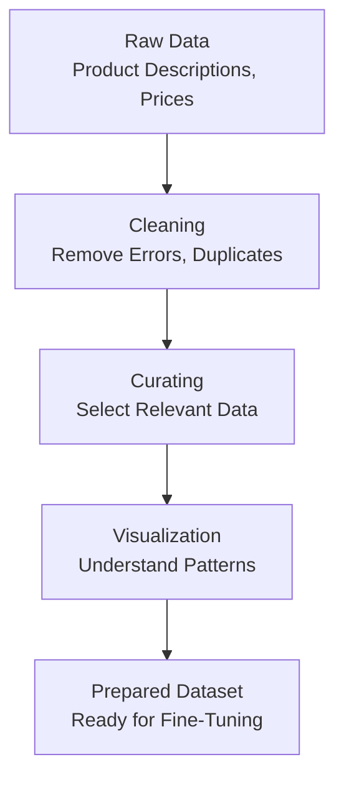
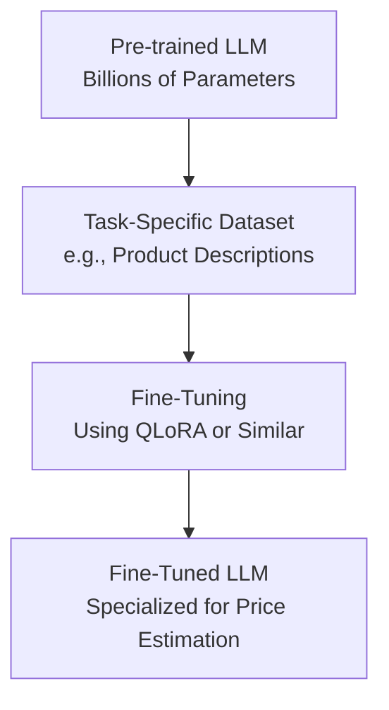
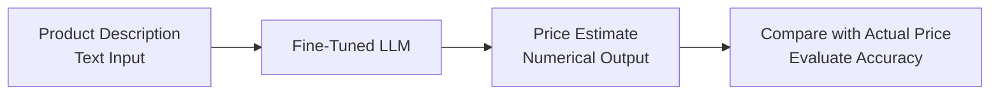
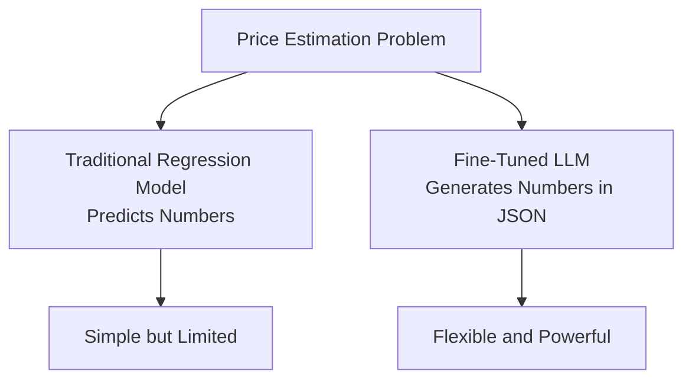
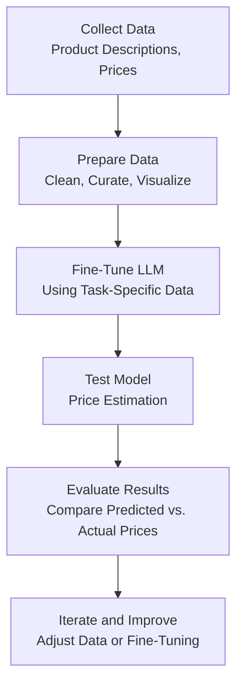

# Fine-Tuning Large Language Models: From Inference to Training

This documentation is designed for beginners to understand the concepts of fine-tuning large language models. It covers the transition from inference to training, the importance of data preparation, and introduces a practical example of fine-tuning a model for a specific task.

---

## Introduction

Fine-tuning large language models is a critical step in making these models more effective for specific tasks. This guide introduces the concepts of inference, training, and fine-tuning, with a focus on preparing and using data effectively. It also outlines a practical example of fine-tuning a model to estimate product prices based on their descriptions, which serves as an accessible and measurable problem for beginners.

The following diagram illustrates the high-level process of moving from a pre-trained model to a fine-tuned model:

---

## What is Inference?

Inference is the process of using a pre-trained language model to make predictions or generate outputs based on input data. For example, when you provide a sentence to a model and it predicts the next word or generates a response, that’s inference.

**Key points about inference:**

- **Pre-trained Models:** These models have been trained on vast amounts of data to understand language patterns.
- **Runtime Predictions:** During inference, the model uses its learned knowledge to predict the next token (e.g., a word or part of a word) based on the input it receives.
- **Techniques to Improve Inference:**
  - Multi-shot Prompting: Providing multiple examples in the prompt to guide the model’s output.
  - Prompt Chaining: Sending multiple prompts in sequence, building on previous outputs to refine results.
  - Tool Usage: Allowing the model to interact with external tools (e.g., calculating prices).
  - Retrieval-Augmented Generation (RAG): Injecting relevant context into the prompt to improve the model’s output.

Inference focuses on optimizing how we use an existing model without changing its internal structure. The following diagram shows the inference process:

---

## Transitioning to Training

Training involves modifying the internal parameters (or weights) of a neural network to improve its performance for a specific task. Unlike inference, which uses a pre-trained model as-is, training adjusts the model to better understand a particular problem or dataset.

**Key differences:**

- **Inference:** Uses a fixed model to generate outputs.
- **Training:** Updates the model’s parameters to improve its predictions.

Training a large language model from scratch is expensive, often costing millions of dollars due to the computational resources required for models with billions of parameters. However, transfer learning makes training more accessible by allowing us to start with a pre-trained model and fine-tune it for a specific task.

The diagram below illustrates the transition from inference to training:

---

## The Importance of Data

Data is the foundation of any successful machine learning project, including fine-tuning LLMs. While data preparation may not seem exciting, it is one of the most critical steps in the process.

**Key aspects of data preparation:**

- **Crafting a Dataset:** Collecting and organizing data relevant to the task.
- **Cleaning and Curating:** Removing errors, duplicates, or irrelevant information to ensure high-quality data.
- **Visualization:** Exploring the data to understand its structure, patterns, and potential issues.
- **Defining Success Metrics:** Establishing clear, measurable goals to evaluate the model’s performance.

For example, if you’re fine-tuning a model to estimate product prices, you need a dataset with product descriptions and their corresponding prices. The quality and relevance of this data directly impact the model’s ability to make accurate predictions.

The following diagram outlines the data preparation process:

---

## What is Fine-Tuning?

Fine-tuning is the process of taking a pre-trained language model and continuing its training on a smaller, task-specific dataset. This allows the model to adapt its general knowledge to a specialized problem.

**Key points:**

- **Transfer Learning:** Fine-tuning leverages the knowledge a model has already gained from large-scale training (e.g., understanding grammar, context, or general facts) and builds on it with task-specific data.
- **Efficiency:** Fine-tuning is less resource-intensive than training a model from scratch, making it feasible for smaller budgets.
- **Techniques:** Methods like QLoRA (Quantized Low-Rank Adaptation) are used to fine-tune models efficiently, reducing memory and computational requirements.
- **Goal:** Adjust the model’s parameters to improve its performance on a specific task, such as generating more accurate outputs or solving a specialized problem.

For example, a pre-trained model might understand language well but struggle to estimate the price of a washing machine based on its description. Fine-tuning with a dataset of product descriptions and prices helps the model learn this specific task.

The diagram below shows the fine-tuning process:

---

## The Commercial Problem: Price Estimation

The example task in this guide is to fine-tune a model for an e-commerce company to estimate the price of products (e.g., electronics, appliances, or car accessories) based on their textual descriptions. This is a practical problem with a clear, measurable outcome.

**Key aspects:**

- **Input:** A textual description of a product (e.g., "A 55-inch 4K LED Smart TV with HDR").
- **Output:** A numerical price estimate (e.g., $599.99).
- **Dataset:** A collection of product descriptions paired with their actual prices.
- **Goal:** Train the model to predict accurate prices based on descriptions alone.

The diagram below illustrates the price estimation task:

---

## Why This Problem?

The price estimation task is chosen for several reasons:

- **Clear Measurability:** Success is easy to evaluate by comparing the model’s predicted price to the actual price, unlike text generation tasks (e.g., translation or summarization), which require subjective or complex metrics.
- **Suitability for LLMs:** While price estimation is traditionally a regression problem, modern LLMs can handle it effectively by generating numerical outputs (e.g., in JSON format). Their emergent intelligence makes them surprisingly good at such tasks.
- **Engaging and Practical:** The problem is relatable and has real-world applications in e-commerce, making it an engaging challenge for beginners.

The following diagram compares traditional regression models and LLMs for price estimation:

---

## Next Steps

The next phase involves diving into the data preparation process, including collecting, cleaning, and visualizing the dataset. You’ll also define success metrics to evaluate the fine-tuned model’s performance. Subsequent steps will cover implementing the fine-tuning process and testing the model on the price estimation task.

The diagram below outlines the overall workflow for the project:

